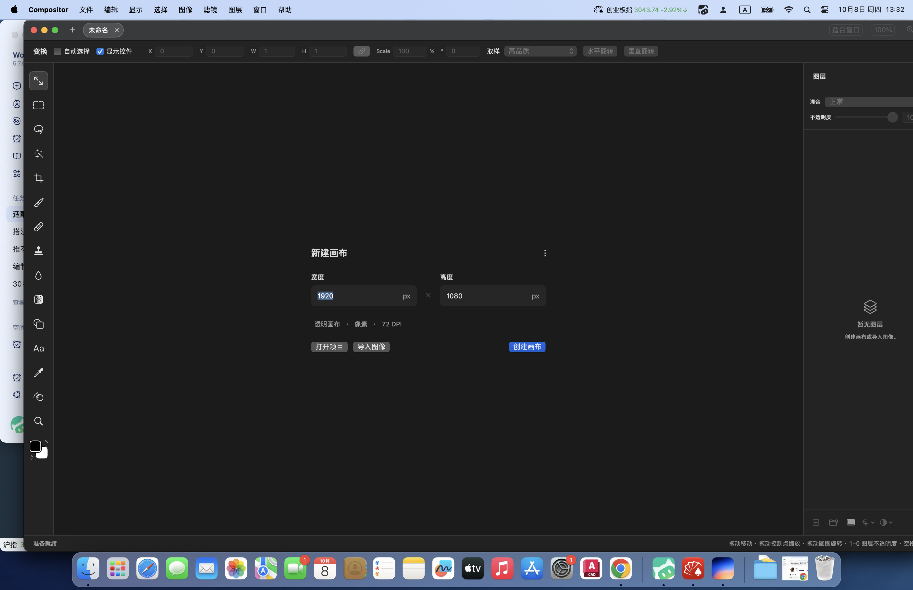

# Compositor · 简体中文版（macOS 14 适配）

一个免费开源的全功能图像编辑器 —— 图层、蒙版、选区、滤镜、Camera Raw、文字与形状工具一应俱全，围绕合成与后期的工作流打造。

> **本仓库不是官方版本。**
> 源项目：**[robbietilton/Compositor](https://github.com/robbietilton/Compositor)**（作者 Robbie Tilton / Wonder Assembly LLC，MIT 协议），在此致谢。
> 官方版本要求 **macOS 26 (Tahoe) + Xcode 26**；本仓库把系统要求降到了 **macOS 14 Sonoma**，并将整个界面**汉化为简体中文**。适配与汉化由 [小枫](https://github.com/li529384084-design) 完成。



## 下载与使用（不想自己编译的看这里）

**系统要求：macOS 14 (Sonoma) 或更高，Intel / Apple Silicon 均可。**

1. 下载成品包（9.5 MB）：
   **[下载 Compositor-macOS14-zh.zip](https://github.com/li529384084-design/compositor-zh/raw/main/download/Compositor-macOS14-zh.zip)**
   （也可以到 `download/` 文件夹里点那个 zip，再点「Download raw file」）
2. 双击解压，得到 `Compositor.app`，拖进「应用程序」文件夹。
3. 第一次打开：在「应用程序」里**右键点它 → 打开 → 再点「打开」**。
   这个确认只会出现一次。原因是本包没有苹果开发者公证（应用是免费开源的，编译者没有付费开发者账号），macOS 对这类应用会先拦一下，**右键打开**即可放行。
4. 如果右键打开仍提示「无法验证开发者」，在终端执行下面这行再打开：
   ```sh
   xattr -dr com.apple.quarantine /Applications/Compositor.app
   ```

打开后就是全中文界面：新建画布或导入图片即可开始，图层、滤镜、文字等工具都在左侧工具条。

## 从源码构建（开发者）

- 要求：macOS 14+、Xcode 15.2 或更高（自带 Command Line Tools 即可）
- 用 Xcode 打开 `Compositor.xcodeproj`，⌘R 运行
- 或命令行构建：
  - `./adaptation/build.sh` —— Debug 构建
  - `./adaptation/build-app.sh` —— 产出可分发的 Release 通用二进制并打包 zip 到 `download/`

> 提示：若编译时报 `swift-plugin-server; failed to initialize`（Swift 宏插件起不来），说明编译进程处于受限沙箱中，在普通终端里编译即可。

## 主要改动

### 1. macOS 14 适配（上游要求 macOS 26）
- 工程文件从 Xcode 16 的同步文件夹格式（objectVersion 77）重建为 Xcode 15 可读格式（objectVersion 56），部署目标 26.0 → 14.0
- 清理 Swift 6.2 才支持的「类型级 nonisolated」写法 197 处，为 90+ 个 UI 类型补回 `@MainActor`
- 回填 macOS 15/26 专属 API（`onGeometryChange`、`ScrollPosition`、`defaultWindowPlacement`、`pointerStyle`、`NSCursor.frameResize` 等），统一收在 `Compositor/UI/CompatibilityShims.swift`
- 移除 Sparkle 自动更新（官方更新通道均要求 macOS 26，对旧系统用户是负资产），并清理 Info.plist 中对应的 Sparkle 配置

### 2. 简体中文
- 1300+ 处界面文案直接翻译进源码，术语对照 Photoshop 中文版（正片叠底、剪贴蒙版、内容识别填充、黑场/白场……）
- 撤销菜单、快捷键面板、命令面板、图层面板右键菜单、底部工具提示条全部覆盖
- 内置 `zh-Hans.lproj`，「文件 / 编辑 / 显示 / 窗口 / 帮助」等系统菜单同样显示中文

`adaptation/` 目录保存了本仓库的全部可复现工具：

| 脚本 | 用途 |
| --- | --- |
| `make_pbxproj.py` | 重新生成 Xcode 15 兼容的工程文件（部署目标 14.0，含 zh-Hans.lproj） |
| `translations.py` | 简体中文对照表（750+ 条） |
| `localize.py` | 把对照表应用到源码（整条字面量精确匹配，另有少量同形异义词的定向替换） |
| `build.sh` | 命令行编译（默认 Debug，第三个参数可选 Release） |
| `build-app.sh` | 构建「可分发」的成品：Release + 通用二进制 + ad-hoc 签名，打包 zip 到 `download/` |

## 与上游的差异说明

- 汉化直接修改了源码中的用户可见字符串（原项目没有任何本地化基础设施），因此工程文件里保存的图层默认名、调整图层名称等也会是中文；与官方版本的项目文件不通用
- 成品包为通用二进制（arm64 + x86_64），Apple Silicon 与 Intel 的 Mac 都能跑

## 协议

MIT，继承自原项目，见 [LICENSE](LICENSE)。版权归原作者 Wonder Assembly LLC 所有，汉化与适配部分同样以 MIT 发布。
